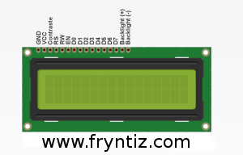

# Librería de Control LCD 1602 con chip HD44780 16x2 Raspberry PI
Pequeña librería para el modelo 1602 chip Hitachi HD44780 con el que trabajar más fácil en este tipo de pantallas de 16 carácteres y 2 líneas.

La mayoría de las pantallas con este chip serán compatibles, aún así el riesgo de usar esta librería y asegurar la compatibilidad de la misma con la pantalla que estés usando no puedo garantizarlo en ningún momento.

Personalmente uso 2 modelos distintos de bajo coste sin problema en casi un año encendida unda de ella.

Mediante los GPIO podemos trabajar de una forma muy sencilla con nuestra raspberry PI, con este script se pretende facilitar el uso de este tipo de pantallas y/o hacer que este funcionando desde el mismo momento en el cual se conecta. También tiene como objetivo servir de apoyo para ser integrado en otros proyectos más ambiciosos como mostrar mensajes de twitter por dicha LCD.



## Información Adicional
Estas pantallas LCD tienen 8 pines de datos (D0-D7) pero no necesitamos conectarlos todos ya que podemos utilizar los pines de la pantalla LCD (D4-D7) para que la información se transmita en paquetes de 4 bits.

De esta forma reducimos notablemente la cantidad de pines en uso para nuestra Raspberry permitiéndonos conectar otra serie de elementos si fuera el caso.

## Dependencias (Solo probado en Raspbian stable)
```Raspbian
sudo apt install -y raspi-gpio python3-rpi.gpio python3-pigpio python3-gpiozero python-rpi.gpio python-pigpio python-gpiozero pigpio
```

## Diagrama de conexión para Raspberry PI 2
El siguiente esquema de conexión es orientativo y no tienes porque hacerlo igual si necesitas usar puertos distintos.

**Esto puede variar en distintos modelos**

Debes prestar atención si tienes otro modelo distinto, en principio entiendo que los modelos Zero, Pi B+, Pi2 y Pi3 deberían ser compatibles con el esquema.

Personalemnte probado en modelos:
* Raspberry Pi ZERO
* Raspberry PI 2 model B
